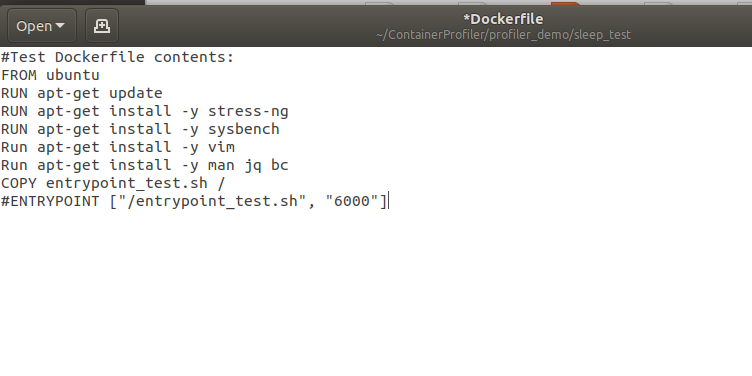
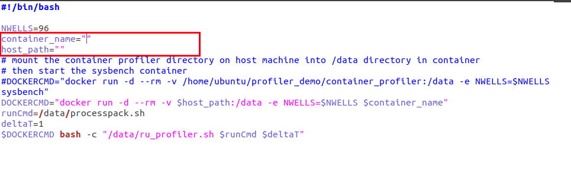
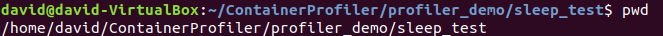

# Container Profiler

University of Washington Tacoma

# Table of Contents
   * [FAQ](#faq)
      * [General](#general)
         * [Why should I use the Container Profiler?](#why-should-i-use-the-Container-Profiler)
      * [Usage](#usage)
         * [How do I use Container Profiler on my own container?](#how-do-i-use-the-Container-Profiler-on-my-own-container)
      * [Miscellaneous](#miscellaneous)
         * [How should I reference the Container Profiler if I use it?](#how-should-i-reference-the-Container-Profiler-if-i-use-it)
   * [MANUAL](#manual)
      * [GENERAL INFORMATION](#general-information)
         * [Overview: Running the Container Profiler](#overview-running-the-container-Profiler)
      * [Container Profiler](#container-profiler-1)
         * [Function Reference](#function-reference)
         * [Metrics Description](#metrics-description)
         * [VM Level Metrics](#vm-level-metrics)
         * [Container Level Metrics](#container-level-metrics)
         * [Process Level Metrics](#process-level-metrics)
      * [Tutorial - Profiling a Container](#tutorial-profiling-a-container)
         * [Video Demonstration](#video-demonstration)
         * [Install the Container Profiler](#Install-the-Container-Profiler)
         * [Preparing the Container Profiler](#Preparing-the-Container-Profiler)
         * [Starting the Profiler](#starting-the-profiler)

# FAQ
## General

### Why should I use the Container Profiler?

#### Easy to use profiling for applications or workflows in a container. 

## Usage

### How do I use the Container Profiler on my own container?

1\. Install the Container Profiler

2\. Set up the Container Profiler scripts to use your Container by editing the processpack.sh script and the runDockerProfiler.sh.

3\. Start the Profiler by running the runDockerProfile.sh script.
## Miscellaneous
### How should I reference the Container Profiler if I use it?

# MANUAL
## GENERAL INFORMATION
The Container Profiler can be used as a tool to profile an application or workflow by taking interval snapshots of a collection of linux resource utilization metrics throughout the course of the job. These snapshots are then stored as JSON data which can then be used to see how the metrics changed once the job is finished.

In order to use the Container Profiler, a container with an application/workflow/script to be run and profiled is needed.
### Overview: Running the Container Profiler


## Container Profiler

ContainerProfiler includes bash scripts **rudataall.sh** to profile the resource utilization on VM level, container level and process level and **deltav2.sh** to compute the delta statistics of resource utilization between two time instances. Detailed usage of the profiler script can be found in the YouTube video linked below (demo scripts can be found in profiler_demo directory).

**Authors:** Wes Lloyd & Huazeng Deng & Ling-hong Hung

**Version:**   0.2

**GitHub:**    https://github.com/wlloyduw/ContainerProfiler

**License:**   Copyright.


## Function Reference
======

**deltav2**.sh calculates the delta from 2 json files produced by **rudataall.sh**

It writes the deltas to stdout in json format and the missing fields to stderr

#### Delta Script Usage:
```bash
deltav2.sh file1.json file2.json 2>missing.txt 1>delta.json
```
Test file and scripts are found in testFiles

#### Description
Basically it loops through file1 to find key : numeric_value pairs and store them in an associative array. It then loops through file2 to print out the json elements and calculate deltas. Missing values in file1 are printed here and a second key numericValue associative array is mad. A third loop then searches through the first associative array to fine missing values in file2. 

As long as there is no more than one key : value pair per line in the json files and the key is unique (i.e. doesn't depend on the structure of the higher order json objects), the script should work fine. It is tolerant of order permutations, new or different fields, and missing lines but depends on file2 being valid json.

## Metrics Description 
=======

The text below describes the metrics captured by the script **rudataall.sh** for profiling resource utilization on the 
virtual machine (VM) level, container level and process level. A complete metrics description spreadsheet can be found at 
https://github.com/wlloyduw/ContainerProfiler/blob/master/metrics_description_for_rudataall.xlsx 

## VM Level Metrics
----------------


| **Attribute** | **Description** |
| ------------- | --------------- |
| vCpuTime | Total CPU time (cpu_user+cpu_kernel) in centiseconds (cs) (hundreths of a second) |
| vCpuTimeUserMode | CPU time for processes executing in user mode in centiseconds (cs) |  
| vCpuTimeKernelMode | CPU time for processes executing in kernel mode in centiseconds (cs) |  
| vCpuIdleTime | CPU idle time in centiseconds (cs) |  
| vCpuTimeIOWait | CPU time waiting for I/O to complete in centiseconds (cs) |  
| vCpuTimeIntSrvc | CPU time servicing interrupts in centiseconds (cs) |  
| vCpuTimeSoftIntSrvc | CPU time servicing soft interrupts in centiseconds (cs) |  
| vCpuContextSwitches | The total number of context switches across all CPUs |  
| vCpuNice | Time spent with niced processes executing in user mode in centiseconds (cs) |  
| vCpuSteal | Time stolen by other operating systems running in a virtual environment in centiseconds (cs) |  
| vCpuType | The model name of the processor |  
| vCpuMhz | The precise speed in MHz for thee processor to the thousandths decimal place |  
| vDiskSectorReads | The number of disk sectors read, where a sector is typically 512 bytes, assumes /dev/sda1|  
| vDiskSectorWrites | The number of disk sectors written, where a sector is typically 512 bytes, assumes /dev/sda1 |  
| vDiskSuccessfulReads | Number of disk reads completed succesfully |
| vDiskMergedReads | Number of disk reads merged together (adjacent and merged for efficiency) |
| vDiskReadTime | Time spent reading from the disk in millisecond (ms) |
| vDiskSuccessfulReads | Number of disk reads completed succesfully |
| vDiskSuccessfulWrites | Number of disk writes completed succesfully |
| vDiskMergedWrites | Number of disk writes merged together (adjacent and merged for efficiency) |
| vDiskWriteTime | Time spent writing in milliseconds (ms) |
| vMemoryTotal | Total amount of usable RAM in kilobytes (KB) |
| vMemoryFree | The amount of physical RAM left unused by the system in kilobytes (KB) |
| vMemoryBuffers | The amount of temporary storage for raw disk blocks in kilobytes (KB) |
| vMemoryCached | The amount of physical RAM used as cache memory in kilobytes (KB) |
| vNetworkBytesRecvd | Network Bytes received assumes eth0 in bytes |
| vNetworkBytesSent | Network Bytes written assumes eth0 in bytes |
| vLoadAvg | The system load average as an average number of running plus waiting threads over the last minute |
| vPgFault | type of exception raised by computer hardware when a running program accesses a memory page that is not currently mapped by the memory management unit (MMU) into the virtual address space of a process|
| vMajorPageFault | Major page faults are expected when a prdocess starts or needs to read in additional data and in these cases do not indicate a problem condition |
| vId | VM ID (default is "unavailable") |
| currentTime | Number of seconds (s) that have elapsed since January 1, 1970 (midnight UTC/GMT) |


      
          
          
## Container Level Metrics
----------------

| **Attribute** | **Description** |
| ------------- | --------------- |
| cCpuTime | Total CPU time consumed by all tasks in this cgroup (including tasks lower in the hierarchy) in nanoseconds (ns) |
| cProcessorStats | Self-defined parameter |
| cCpu${i}TIME | CPU time consumed on each CPU by all tasks in this cgroup (including tasks lower in the hierarchy) in nanoseconds (ns) |
| cNumProcessors | Number of CPU processors |
| cCpuTimeUserMode | CPU time consumed by tasks in user mode in this cgroup in centiseconds (cs) |
| cCpuTimeKernelMode | PU time consumed by tasks in kernel mode in this cgroup in centiseconds (cs) |
| cDiskSectorIO | Number of sectors transferred to or from specific devices by a cgroup |
| cDiskReadBytes | Number of bytes transferred from specific devices by a cgroup in bytes |
| cDiskWriteBytes | Number of bytes transferred to specific devices by a cgroup in bytes |
| cMemoryUsed | Total current memory usage by processes in the cgroup in bytes |
| cMemoryMaxUsed | Maximum memory used by processes in the cgroup in bytes |
| cNetworkBytesRecvd | The number of bytes each interface has received |
| cNetworkBytesSent | The number of bytes each interface has sent |
| cId | Container ID |


##

## Process Level Metrics
----------------

| **Attribute** | **Description** |
| ------------- | --------------- |
| pId | Process ID |  
| pNumThreads | Number of threads in this process |  
| pCpuTimeUserMode | Total CPU time this process was scheduled in user mode, measured in clock ticks (divide by sysconf(\_SC_CLK_TCK)) |  
| pCpuTimeKernelMode | Total CPU time this process was scheduled in kernel mode, measured in clock ticks (divide by sysconf(\_SC_CLK_TCK)) |
| pChildrenUserMode | Total time children processes of the parent were scheduled in user mode, measured in clock ticks |
| pChildrenKernelMode | Total time children processes of the parent were scheduled in kernel mode, measured in clock ticks |
| pVoluntaryContextSwitches | Number of voluntary context switches | 
| pNonvoluntaryContextSwitches | Number of involuntary context switches | 
| pBlockIODelays | Aggregated block I/O delays, measured in clock ticks | 
| pVirtualMemoryBytes | Virtual memory size in bytes | 
| pResidentSetSize | Resident Set Size: number of pages the process has in real memory.  This is just the pages which count toward text, data, or stack space.  This does not include pages which have not been demand-loaded in, or which are swapped out | 
| pNumProcesses | Number of processes inside a container | 

       

## Tutorial: Profiling a Container

## Video Demonstration
**Video:**     https://youtu.be/X-_7zqeyffk
## Install the Container Profiler
```bash
git clone https://github.com/wlloyduw/ContainerProfiler
```

## Preparing the Container Profiler - Method 1
Navigate to /ContainerProfile/profiler_demo/sleep_test


Open "Dockerfile"



  1) This file determines how your container is built and with what packages. Make sure you keep the first run line ("RUN apt-get install update -y"), but remove/add any other packages you may need. For this tutorial, leave this file unedited.

Now that the dockerfile is set up, you can build the container with the command "sudo docker build -t 'container-name' ." (Can replace container-name with any name). To confirm the creation of the container, typing sudo docker images into the console will let you see if the container has been created.


 
Open "runDockerProfile.sh". The line starting with "DOCKERCMD=" is doing a lot of stuff.  It is building the command that will start the docker container and mounts the directory on the host machine that is running the tool to the data directory in the container.  This is necessary in order to get the json ouput files containing all your metrics onto your host machine.  Otherwise they would go away when the container dies.



There are two empty variables in this file that need to be set. One is the container name, and the other is your host path. The container name needs to be the name of the container you are running, and the host path is the path to where the tool is running (Can use "pwd" in terminal to confirm the directory is correct).



Open "process_pack.sh".  This file contains the bash commands that will be executed in the container.  It contains the commands for sysbench and stress-ng by default.  Delete them and enter your own commands for the job you'd like to profile. For this tutorial, you should leave this file unedited.


## Preparing the Container Profiler - Method 2
An alternate method to using the container profiler by downloading the alpine/ubuntu containerized version.

To build

docker build -t biodepot/profiler:alpine_3.7 .
To use the alpine container

docker run --rm  -it -v $PWD:/.cprofiles  biodepot/profiler:alpine_3.7 sleep 10
If you leave out the volume mapping

-v <host_dir>:/.cprofiles
then no profiling will take place. Otherwise the json files will appear in <host_dir>

The delta is set to 1 second by default. This can be changed by changing the DELTA environment variable i.e.

The following command collects data every 2 seconds

docker run --rm  -it -v $PWD:/.cprofiles -e DELTA=2 biodepot/profiler:alpine_3.7 sleep 10
Finally, internally the json files are stored in the /.cprofiles directory. This can be changed using the OUTPUTDIR environment variable i.e. to have the json files written internally to /var/profiles:

docker run --rm  -it -v $PWD:/var/profiles -e OUTPUTDIR='/var/profiles' biodepot/profiler:alpine_3.7 sleep 10
This option is included on the off-chance that the default /.cprofiles is in use for something else.


## Graph Visualizations

The container profiler offers scripts that can be used to graph JSON output from the container profiler.

The guide to using the graphing scripts can be found here: [link to Graphing scripts!](https://github.com/wlloyduw/ContainerProfiler/tree/david/profiler_demo/sleep_test/Graphing)


## JSON to CSV
In addition to graphing scripts, we also provide a script to convert JSON data to CSV files. Each JSON file correspond to a row in a CSV file, and the column data will be the resource utilization metrics. The JSONtoCSV script can be found here:
